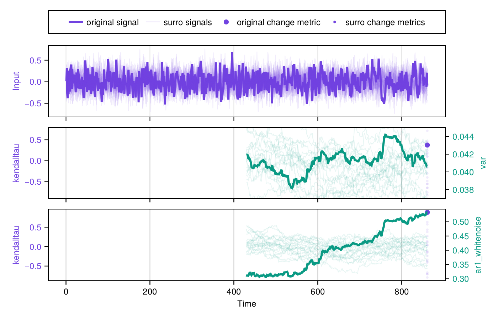

# Summary

Transitions of nonlinear dynamical systems can significantly impact individuals
and society. Examples of this are ubiquitous and include the onset of cardiac arrhythmia
[@tse_mechanisms_2016], the deglaciation of Earth about 20,000 years ago [@wolff_changes_2010]
and the recent price collapse of many cryptocurrencies [@ismail_detecting_2020]. The systems
displaying such transitions are usually monitored by measuring state variables
that are believed to be representative of the underlying process. Researchers analyze the
resulting timeseries with various methods to detect past transitions and predict
future ones.

# Statement of need

Over the last decades, methods to detect and predict transitions from timeseries have gained
a lot of attention, both inside and outside of the scientific community. For instance, recent
work predicting a collapse of the Atlantic Meridional Overturning Circulation between 2025
and 2095 has led to no less than 870 news outlets and 4100 tweets [@ditlevsen_warning_2023],
largely because of the substantial implications of such a collapse for human societies.
A common concern in the scientific community is that published work on the topic is difficult
to reproduce, despite the impact it implies for humanity.
This can be largely addressed by a unifying software that is accessible, performant,
reproducible, reliable and extensible. Such a software does not exist yet, but here
we propose TransitionsInTimeseries.jl to fill this gap.
We believe this is a major step towards establishing a software as standard, widely used
by academics working on transitions in timeseries.

# TransitionsInTimeseries.jl

## Accessibility

### Open-source

TransitionsInTimeseries.jl is a free and open-source software, written in Julia and
developed on GitHub, which allows any user to track the full history of the changes made
to the software as well as to suggest new ones by opening a pull request or an issue.

### Ease of use

TransitionsInTimeseries.jl is accessible to any scientist thanks to the convenience functions
it provides to detect and predict transitions in timeseries
with only a few lines of code. A frequent prediction technique relies on observing, prior to
a transition, an increase of the variance and the AR1 regression coefficient of the detrended
timeseries, which is a consequence of Critical Slowing Down
(CSD, [@scheffer_early-warning_2009]) and is here measured by Kendall's $\tau$ coefficient.
To assess whether this increase is significant, one can perform a statistical test, for
instance by performing the same computations on 1,000 surrogates of the original timeseries
[@haaga_timeseriessurrogatesjl_2022]. The increase in variance and AR1 coefficient can be
considered significant if the original timeseries classifies in the uppermost 5% of the
surrogates, corresponding to a p-value $p<0.05$. All these steps can be performed, along with a
visualisation of the results within a few lines only:

```julia
using TransitionsInTimeseries, CairoMakie, Random

# Loading and preprocessing the data needs to be done by the user
time, data = load_data()
residual = data - filt(data)

# Choose the indicators and how to measure their change over time
indicators = (var, ar1_whitenoise)
change_metrics = (kendalltau, kendalltau)

# Configuration with adequate parameters of the sliding window over a segment
config = SegmentedWindowConfig(indicators, change_metrics, [time[1]], [time[end]];
    width_ind = length(residual) ÷ 2, whichtime = last, min_width_cha = 100)

# Compute the metrics over sliding windows and their significance
results = estimate_changes(config, data, time)
signif = SurrogatesSignificance(n = 1000, tail = (:right, :right), rng = Xoshiro(1995))
flags = significant_transitions(results, signif)

# Visualize the results
fig = plot_changes_significance(results, signif)
```

We apply this code to data generated by a Ricker model presenting an abrupt transition
at $t = 860$, which is used in the first tutorial of `ewstools` [@bury_ewstools_2023],
the most recent software covering similar functionalities.
The results are shown in [Fig. 1](@figure1) and display, as expected from CSD theory, an
increase in both variance and AR1 coefficient, which is exactly the same as computed
by `ewstools`. However, calling `signif.pvalues` shows that the increase in variance is not
significant ($p = 0.284$), whereas the increase in AR1 coefficient is ($p = 0.001$).



We believe that a concise and unambiguous code will greatly reduce the programming effort of
many researchers and ease the code reviewing process. Finally, the code
documentation provides a thorough API description as well as additional examples,
showcasing that the simplicity of the code also applies to real-world applications.

## Performance

TransitionsInTimeseries.jl is written in Julia, which offers both a simple syntax and good
performance. Additionally, all performance-relevant steps have been optimized and
parallelized when possible, as, for instance, the significance testing relying on surrogates.
In the final section of this article, we present a comparison to `ewstools`, showing that
TransitionsInTimeseries.jl offers a significant speed-up in all the studied cases.

## Reproducibility

Some steps of a transition analysis involve random number generators, which need
to be handled with care in parallelized codes. This is done in TransitionsInTimeseries.jl,
which offers the possibility of seeding a random number generator by using the
keyword argument `rng`, as done in the example shown above. Furthermore,
TransitionsInTimeseries.jl follows the guidelines of semantic versioning which,
along with Julia's integrated package manager, ensures that the same code is used for both
results generation and peer reviewing.

## Reliability

In the high-impact context mentioned in the introduction, it is crucial to avoid errors.
TransitionsInTimeseries.jl is therefore tested via continuous integration on a large test
suite, thus providing a reliable research framework. Furthermore, a centralized code base
implies that any new user is a new test, thus increasing the reliability of the code over
time. Finally, the robustness of the results with respect to a parameter, e.g. the width
of the sliding window, can be easily studied thanks to the simple syntax, thus contributing
to the reliability of the results.

## Extensibility

An important aspect of the modularity mentioned above, is that self-written functions can be
passed as indicators or change metrics. Thus, researchers can easily
test new methods without any programming overhead, nor modification of the source code. To
illustrate this, the code shown above can include the skewness as indicator of the
transition by modifying a few lines:

```julia
skewness(x::Vector) = mean( (x .- mean(x))^3 ) / mean( (x .- mean(x))^2 )^1.5
indicators = (var, ar1_whitenoise, skewness)
change_metrics = (kendalltau, kendalltau, kendalltau)
```

There is no complexity restriction on the self-programmed functions, as long as they comply
with the structure of taking a vector as input and returning a scalar as output.

## Integration

TransitionsInTimeseries.jl is designed to be well integrated into the Julia ecosystem.
Functions can be imported from other packages and subsequently passed as indicators or
change metrics. For instance, the skewness implemented above can be loaded from StatsBase.jl
instead. TransitionsInTimeseries.jl therefore offers an extremely wide and
potentially unlimited library of indicators. Furthermore, TimeseriesSurrogates.jl
[@haaga_timeseriessurrogatesjl_2022] is used to create surrogates of the timeseries,
thus offering optimized routines with numerous surrogate types.


## Versatility

### Choosing a pipeline

TransitionsInTimeseries.jl covers methods for prediction as well as detection of transitions,
which is unprecedented to our knowledge. This relies on the definition of different analysis pipelines, which
consist in a `ChangesConfig` determining the behavior of `estimate_changes` via
multiple dispatch. For instance, a detection
task can be performed by replacing the `SegmentedWindowConfig` by a `SlidingWindowConfig`
in the code above:

```julia
# Here the data should not be detrended
time, data = load_data()

indicators = nothing
change_metrics = (difference_of_mean(), difference_of_max())
config = SlidingWindowConfig(indicators, change_metrics;
   width_cha = 50, whichtime = midpoint)
results = estimate_changes(config, data, time)
```

We here skip the computation of indicators and compare the difference in mean and maximum
values between the two halves of the sliding window, which gives a particularly high value
in the case of an abrupt transition and is therefore suited for some detection tasks.
Most importantly, this examples shows that the user can choose the type of analysis pipeline,
along with its underlying parameters (e.g. sliding window width). Similarly, different
ways of testing for significance are provided and can be interchangeably used.

### Creating your own pipeline

Besides choosing among the already provided analysis pipelines,
the user can implement their own one by defining a new `ChangesConfig` and
the corresponding behavior of `estimate_changes`. This makes it particularly
easy to leverage pre-existing functionalities of TransitionsInTimeseries.jl
with a minimal restriction on the structure. As explained in the devdocs, the latter eases
the integration of new methods into a unified framework. This also holds for the
significance pipeline and makes TransitionsInTimeseries.jl particularly versatile.

# Comparison to already existing alternatives

`earlywarnings` [@dakos_methods_2012] and `spatialwarnings` are toolboxes written in R
providing many tools to predict transitions.
These are early and valuable efforts but are (1) restricted to
prediction tasks, (2) written in a less performant language, (3) not parallelised, (4) not
designed for convenient reproducibility and (5) not extensible.

`ewstools` [@bury_ewstools_2023] is a Python/TensorFlow package offering similar
functionalities as `earlywarnings`, as well as a deep-learning approach to predicting
transitions [@bury_deep_2021]. This effort addresses some drawbacks of `earlywarnings`,
mainly (4) and to a lesser extent (2) and (3). This is a great step forward but does not
provide a generic and extensible framework for researchers to test new methods on both
detection and prediction tasks. We believe that this is now covered by
TransitionsInTimeseries.jl.

Using TransitionsInTimeseries.jl, we reproduced the computations showcased in Tutorial 1
and Tutorial 2 of the `ewstools` documentation, along with the block bootstrapping. We
performed each computation 100 times and show the resulting run times in [Fig. 2](@figure2).
It appears that all computation are faster in TransitionsInTimeseries, with a speed-up factor
ranging from 0 to 3 orders of magnitude. The implementation of the deep-learning classifiers
for transition prediction developed in [@bury_deep_2021], as well as dealing with
multidimensional timeseries, are part of future developments of TransitionsInTimeseries.jl.


# Documentation

The documentation of TransitionsInTimseries.jl is available at
<https://docs.juliahub.com/General/TransitionsInTimeseries/stable/>

# Acknowledgements

Jan Swierczek-Jereczek is funded by CriticalEarth, grant no. 956170, an H2020 Research
Infrastructure of the European Commission. George Datseris is funded by UKRI's Engineering and
Physical Sciences Research Council, grant no. EP/Y01653X/1 (grant agreement for a EU
Marie Sklodowska-Curie Postdoctoral Fellowship).

# References